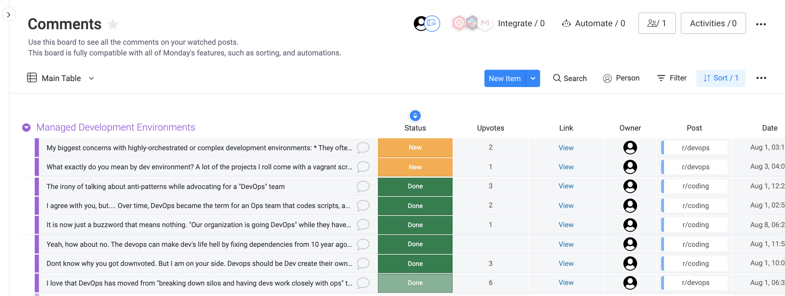

**_Customized Content Engagement Workflows_**

Announcer is a [monday.com](https://monday.com) app that makes it easy to
engage with your audience.

Announcer automatically adds new comments on your content to your Monday
boards. From there, you can create custom workflows with Monday's automations to
make sure that you never miss important comments, and that you get the most out
of your posts!

## Motivation

I've noticed that many teams create great content, but don't maximize its
potential because they don't handle **comments** well. In many ways, **comments
are more important than the post itself**. Consider the fact that many
people just read the discussions in the comments, and not the post itself.

The comment section on sites like Reddit and HackerNews can make or break a
post. Positive comments drive more clickthroughs to your content, while
negative responses can quickly drive people away. Comments are also an
opportunity to build [personal
connections](https://orbit.love/blog/why-orbit-is-better-than-funnel-for-developer-relations/) with the community.

Unfortunately, it's hard to stay on top of comments. A single post gets
submitted to many different sites and subreddits, so it's easy to miss comment
notifications. Plus, the content author is almost always different than the
account owner that gets the notifications, so comments can get lost even after
receiving a notification.

Announcer was built so that teams could stay on top of their comments and get
the most out of every post.

## Features

### Automatically create items for new comments

* New comments on posts in the [Posts board](./images/posts-board.png) get automatically added to the comments board.
* The Group organization in the Posts board gets mirrored in the comments board.
* Automatically assign and notify authors of new comments.

### Alternate board views

Monday's Kanban view works out of the box so that you can quickly see what
comments still need to be processed.

### Get context

The threaded comments view lets you visualize comment threads right from
Monday.

### Slack integration

Works out of the box with integrations such as Slack. Add any Monday automation
to suit your workflow.

### Supported Sites

Reddit is currently the only supported site, but Announcer was intentionally
designed to make it easy to [add
plugins](./comment-watcher/src/workers/index.js) for other sites.

Contributions to support sites like HackerNews, Medium, and Stackoverflow are
most welcome!

## Installation

1. [Install the Announcer
   app](https://auth.monday.com/oauth2/authorize?client_id=047adcc7da9e2d5404a8646cc95345dd&response_type=install).
   This contains the comments tracker integration, the threaded comments view,
   and a workspace template.

1. Create the Announcer boards by clicking on "New from template" and
   searching for "Social Media Comment Tracker".

1. Add the Announcer comment tracker integration by searching for "Announcer"
   in the Monday integrations center. Point the "posts board" and "comments
   board" settings to boards created by the template in the previous step.

1. That's it! Add a post to the Posts board, and watch as comments are
   automatically added to the Comments board.

## Architecture

This repo contains the source code for the [comment watcher
integration](./comment-watcher) and the [threaded comments
view](./threaded-view).

The threaded comments view is a React app that's loaded as an iframe by Monday.

The comment watcher integration polls the posts intermittently. It stores
subscriber information in a Mongo database, and caches requests to Monday to
avoid rate limits.

